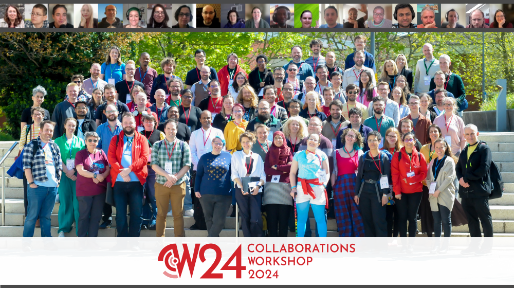

.. _in-practice-cw24:

Collaborations Workshop 2021 (CW21) - Online 
=============================================

In Practice authors: Patricia Herterich (`ORCID <https://orcid.org/0000-0002-4542-9906>`__), Graeme Smith, Aleksandra Nenadic (`ORCID <https://orcid.org/0000-0002-2269-3894>`__), Oscar Seip (`ORCID <https://orcid.org/0000-0002-8503-2698>`__), Denis Barclay (`ORCID <https://orcid.org/0009-0008-5567-3786>`__), Shoaib Sufi (`ORCID <https://orcid.org/0000-0001-6390-2616>`__), Kathleen Glass

Based on the draft for CW23 created by Rachael Ainsworth (`ORCID <http://orcid.org/0000-0003-2591-9462>`__)

The Collaborations Workshop (CW) is the annual flagship event of the `Software Sustainability Institute <www.software.ac.uk>`_ (SSI). It brings together researchers, developers, innovators, managers, funders, publishers, leaders, and educators with a focus on research software to explore and share best practice. 

Following a successful hybrid CW23, it was decided from the beginning that Collaborations Workshop 2024 (CW24) would be a hybrid event again to maintain accessibility of the event to people who were unable to attend in person and continue to innovate and trial within a hybrid event space to provide guidance and advice on running hybrid events to our community.

This In Practice write up covers how we organised CW24, following the steps in the `Feasibility Stage <https://event-organisation-guide.readthedocs.io/en/latest/eog/feasibility-stage.html>`_ and the Event Project Stage of the SSI’s Event Organisation Guide.

If you are interested in the experience of attending CW24 or history of CWs, the Code for Thought podcast released `an episode reporting on the event <https://codeforthought.buzzsprout.com/1326658/15045013-en-collaborations-workshop-2024>`_ and there was a `blog post written <https://www.software.ac.uk/blog/research-it-collaborations-workshop-2024>`_ by members of the University of Manchester Research IT team.

.. toctree::
   :maxdepth: 2
   :caption: Sections:

   feasibility-stage/feasibility-stage
   event-project-stage/event-project-stage
